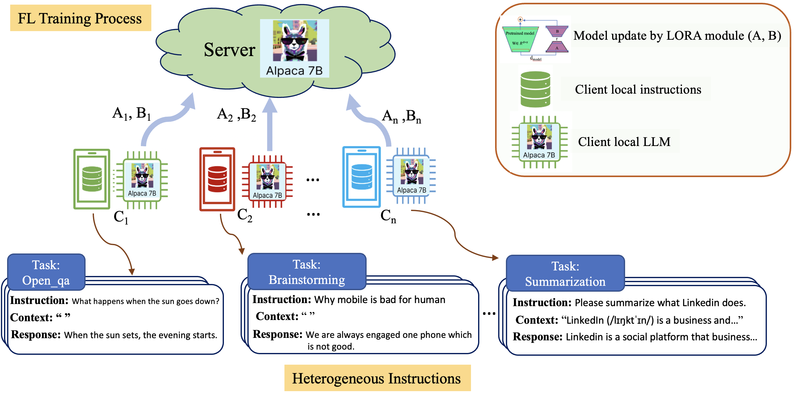
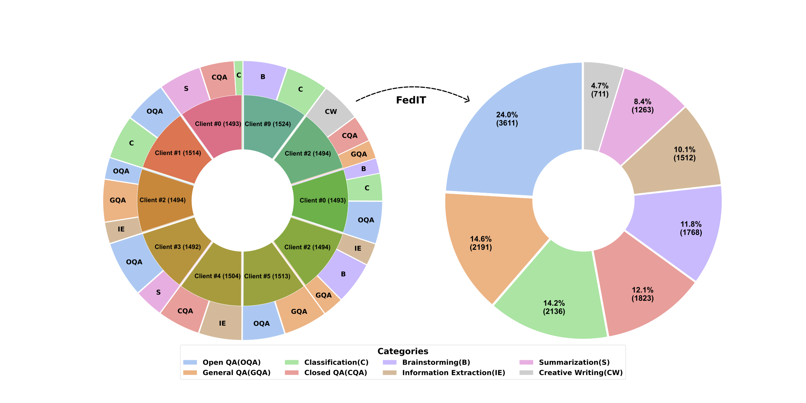

<h1 align="center">
  
  <br>
  Shepherd
  <br>
</h1>
<h4 align="center"><em><span style="font-size:18pt"> A Platform Supporting Federated Instruction Tuning </span></em></h4>

<p align="center">
  <a href="#Overview">Overview</a> •
  <a href="https://arxiv.org/pdf/2305.05644.pdf">Paper</a> •
  <a href="#Installation">Installation</a> •
  <a href="#Data_Preparation">Data_Preparation</a> •
  <a href="#Federated_Finetuning">Federated_Finetuning</a> •
  <a href="#Inference">Inference</a> •
  <a href="#Citation">Citation</a> 
</p>


[](https://github.com/JayZhang42/FederatedGPT-Shepherd/blob/main/LICENSE) \
**Usage and License Notices**:The data, code and checkpoints are intended and licensed for research use only.

## Overview

Recent advancements in fine-tuning large language models (LLMs) have leveraged instructions created by humans or APIs (such as ChatGPT and GPT-4) to revolutionize NLP research and industry applications. However, the collection of instructions from a wide array of individuals presents challenges in cost and privacy. For instance, collecting vast amounts of daily conversations from users is a valuable means of providing guidance for LLMs, enabling them to generate authentic and genuine responses. However, privacy concerns may hinder users from sharing their conversations, resulting in a limited quantity of instructions that are not fully representative of the target population. Federated Learning, a well-studied and well-developed learning approach, provides a solution to addresses these challenges and paves the way for designing personalized LLMs tailored to individual users.

This repository, *Shepherd*, offers a foundational framework for exploring federated finetuning of LLMs using heterogeneous instructions across diverse categories. The framework is designed for ease of use, adaptability, and scalability to accommodate large datasets. Additionally, it facilitates seamless integration of novel algorithms and configurations, making it a convenient tool for researchers and practitioners in both the FL and the NLP community.

## Paper

We are pleased to share our [***FedIT***](https://arxiv.org/pdf/2305.05644.pdf) [Paper], "*Towards Building the Federated GPT: Federated Instruction Tuning.*" We kindly invite you to read the paper for an in-depth understanding of Federated Instruction Tuning for LLMs and further insights into our repository.
<p align="center">
  
</p>

## Installation 

The code requires some dependencies (Python=3.8)  as specified in `requirements.txt`. Please follow the relevant libraries to install or run:
```bash
pip install -r requirements.txt
```
If `bitsandbytes` doesn't work, [install it from source](https://github.com/TimDettmers/bitsandbytes/blob/main/compile_from_source.md). Windows users can follow [these instructions](https://github.com/tloen/alpaca-lora/issues/17).


## Data_Preparation

Prior to commencing the federated fine-tuning, make sure to create a data file for each individual client.
```bash
num_client=10 # The number of clients
diff_quantity=0 # Whether clients have different amounts of data
python client_data_allocation.py $num_client $diff_quantity
```
Running this command will save the data files in the folder `./data/str(num_client)`. The data file `new-databricks-dolly-15k.json` for generating each client's local dataset is the first version of `databricks-dolly-15k` , which is a corpus of more than 15,000 records with 8 categeries generated by thousands of [Databricks Lab](https://www.databricks.com/learn/labs) employees. Please refer to their official repository [dolly](https://github.com/databrickslabs/dolly) for the latest version of data.

### Categories distribution and Heteogeneity
The first version of `databricks-dolly-15k` contains 8 Categories, with the distribution of each category shown in the following subfigure provided on the right.

<p align="center">
  
</p>

Without federated learning, the model can be trained on only the particular local instruction categories of each user (left) due to privacy or cost issue. By implementing our Federated instruction tuning ([***FedIT***](https://arxiv.org/pdf/2305.05644.pdf)) framework with this repo *Shepherd*, the LLM can be trained on the local instruction datasets of all clients with greater diversity and quantity of data points that cover the entire range of the subject matter (right).

The following figure presents an illustrative depiction of the category distributions among each client, serving to exemplify the heterogeneity nature of clients' instructions.

<p align="center">
  
</p>

### Use your own data

You can simply modify `client_data_allocation.py` to load your own  dataset for federated training.


## Federated_Finetuning

To fully leverage the computational resources of each participating client, our lightweight Federated Learning framework employs the well-established parameter-efficient method, [LoRA](https://github.com/microsoft/LoRA), for conducting local training. The local training process is built upon the implementations of Hugging Face's [PEFT](https://github.com/huggingface/peft), Tim Dettmers' [bitsandbytes](https://github.com/TimDettmers/bitsandbytes), and the [Alpaca-lora](https://github.com/tloen/alpaca-lora), enabling the training to be completed within hours on a single NVIDIA TITAN RTX.

Example usage:
```bash
python main.py --global_model 'chavinlo/alpaca-native'\
      --data_path  "./data" \
      --output_dir  './lora-shepherd-7b/'\
      --num_communication_rounds 10 \
      --num_clients  10 \
      --train_on_inputs \
      --group_by_length
```
Within the `main.py` file, the GeneralClient is a Python class serves as a representation of the local client and encompasses five distinct sections that facilitate local training: "prepare_local_dataset," "build_local_trainer," "initiate_local_training," "train," and "terminate_local_training." Each of these sections is easy to comprehend and can be easily customized by adding your own functions to meet specific requirements.

We can also tweak the hyperparameters:
```bash
python main.py --global_model 'chavinlo/alpaca-native'\
      --data_path  "./data" \
      --output_dir  './lora-shepherd-7b/'\
      --num_communication_rounds 10 \
      --num_clients  10 \
      --client_selection_frac 0.1 \
      --local_num_epochs  2 \
      --local_batch_size  64 \
      --local_micro_batch_size 32 \
      --local_learning_rate 0.0003 \
      --lora_r 8 \
      --lora_target_modules='[q_proj,k_proj,v_proj,o_proj]' \
      --train_on_inputs \
      --group_by_length
```

Our framework supports numerous popular LLMs, such as [LLaMA](https://github.com/facebookresearch/llama), [Alpaca](https://github.com/tatsu-lab/stanford_alpaca), [Vicuna](https://vicuna.lmsys.org/), [Baize](https://github.com/project-baize/baize-chatbot), and others. We welcome any pull requests that adapt our code to support additional models or datasets.


## Inference 

The `GlobalModel_generate.py` file streamlines the inference process for the global model by utilizing a Gradio interface. This file loads the foundation model from the Hugging Face Model Hub and obtains the LoRA weights and configurations from the output directory.

```bash
python GlobalModel_generate.py \
      --load_8bit \
      --base_model 'chavinlo/alpaca-native' \
      --lora_weights_path /output/path/to/lora_weights  \
      --lora_config_path /output/path/to/lora_config   
      
```


## Citation

Please cite our FedIT paper and this repo if you find our repository helpful for your research. Thank you!
```
@misc{zhang2023building,
      title={Towards Building the Federated GPT: Federated Instruction Tuning}, 
      author={Jianyi Zhang and Saeed Vahidian and Martin Kuo and Chunyuan Li and Ruiyi Zhang and Guoyin Wang and Yiran Chen},
      year={2023},
      eprint={2305.05644},
      archivePrefix={arXiv},
      primaryClass={cs.CL}
}
```
```
@misc{Shepherdgithub,
  author = {Jianyi Zhang and Martin Kuo and Ruiyi Zhang and Guoyin Wang and Saeed Vahidian and Yiran Chen},
  title = {Shepherd: A Lightweight GitHub Platform Supporting Federated Instruction Tuning},
  year = {2023},
  publisher = {GitHub},
  journal = {GitHub repository},
  howpublished = {\url{https://github.com/JayZhang42/FederatedGPT-Shepherd}},
}
```

## Note!

We are constantly working to enhance this framework by resolving bugs and extending its functionality and simulation capabilities. We welcome pull requests that adapt our code to support additional research goals, such as benchmarking of models and datasets, algorithmic enhancements, and hardware simulation.


